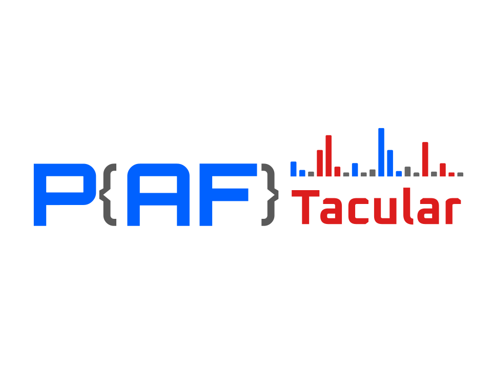

# paftacular

<div align="center">
  

  A Python library for parsing and serializing **mzPAF** (Peak Annotation Format), a standardized format for annotating mass spectrometry fragment ions in peptide/proteomics analysis. mzPAF is a specification from the [Proteomics Standards Initiative (PSI)](https://www.psidev.info/) that provides a compact, human-readable notation for describing fragment ion types, chemical modifications, charge states, mass errors, and confidence scores.

    
  [](https://github.com/tacular-omics/paftacular/actions/workflows/python-package.yml)
[](https://codecov.io/github/tacular-omics/paftacular)
  [](https://paftacular.readthedocs.io/en/latest/?badge=latest)
  [](https://badge.fury.io/py/paftacular)
  [](https://doi.org/10.5281/zenodo.19076277)
  [](https://www.python.org/downloads/)
  [](https://opensource.org/licenses/MIT)
  
</div>

Features
--------

* **mzPAF parsing**: Handles parsing / serializing of mzPAF strings
* **Properties**: Supports calculating mass and composition of annotated ions
* **Type annotations**: Includes a `py.typed` marker for static type checking
* **Caching**: repeated modifier and selected ion components share bounded instance caches
* **Peptacular**: Optionally integrated with peptacular to enable parsing of included sequences and generation of mzPAF annotations

## Installation

```bash
pip install paftacular
pip install paftacular[peptacular] # with peptacular integration
pip install paftacular[smiles]     # with SMILES support
pip install paftacular[all]        # with all optional dependencies
```

## Quick Start


There are 3 parsing methods available:
* ``parse``: Parses a single or multiple comma-separated mzPAF annotations. Returns a single ``PafAnnotation`` or a list of them.
* ``parse_multi``: Parses multiple comma-separated mzPAF annotations. Always returns a list of ``PafAnnotation``.
* ``parse_single``: Parses a single mzPAF annotation. Returns a single ``PafAnnotation``. Raises ValueError if multiple annotations are provided.


```python
import paftacular as pft

# Parse a simple peptide ion
ann = pft.parse("y5")
print(ann.ion_type.series)  # y
print(ann.ion_type.position)  # 5

# Calculate masses
print(ann.mass())              # Ion offset only, because y5 has no sequence context
print(ann.serialize())         # Round-trip back to string

# Parse multiple ions
anns = pft.parse("y5-H2O^2/1.2ppm*0.95,b3^2")
for ann in anns:
  print(ann.charge)
  print(ann.mass_error.value if ann.mass_error else None)
  print(ann.confidence)
```

## Resolve peptide context

With `paftacular[peptacular]` installed, resolve a fragment against a full ProForma analyte before calculating its complete mass:

```python
import paftacular as pft

ann = pft.parse_single("y2").resolve("PEPTIDE")
print(ann.sequence)  # DE
print(ann.mz())
```

Without an embedded or resolved sequence, peptide and precursor calculations return only the ion offset and modifiers. Resolved context is preserved by `to_dict()`, while mzPAF serialization preserves the original annotation text structure.

## Batch parsing and interchange

```python
import json
import paftacular as pft

for result in pft.iter_parse(["y2,b3", "invalid", "p^2"]):
    if result.ok:
        print(result.index, len(result.annotations))
    else:
        print(result.index, result.error.position, result.error.reason)

ann = pft.parse_single("y2/0.000001ppm")
restored = pft.PafAnnotation.from_dict(json.loads(json.dumps(ann.to_dict())))
assert restored == ann
```

`to_dict()` produces versioned component data. The existing `as_dict()` remains a compact display representation.

## Documentation

Full documentation is available at [Read the Docs](https://paftacular.readthedocs.io/).

## Citation

If you use paftacular in research, cite the archived software release. Machine-readable citation metadata is available in [`CITATION.cff`](CITATION.cff); GitHub's **Cite this repository** menu can render it as APA or BibTeX. The stable DOI for all versions is [10.5281/zenodo.19076277](https://doi.org/10.5281/zenodo.19076277); individual releases also receive version-specific DOIs from Zenodo.

## mzPAF Format

The mzPAF format uses compact notation:

```
[&][analyte@]ion_type[modifications][^charge][/mass_error][*confidence]
```

Examples: `y5`, `b2{PEP}`, `y5-H2O^2`, `y5/1.2ppm*0.95`

See the [PSI mzPAF specification](https://www.psidev.info/mzpaf) for full details.

## License

paftacular is distributed under the [MIT License](LICENSE). The bundled mzPAF specification remains under its own PSI copyright and distribution terms; see [third-party notices](THIRD_PARTY_NOTICES.md).

## Contributing

See [CONTRIBUTING.md](CONTRIBUTING.md) for development setup, issue reporting, support, and pull-request guidance. Project governance is described in [GOVERNANCE.md](GOVERNANCE.md), and security reports are handled according to [SECURITY.md](SECURITY.md).

**Author:** Patrick Garrett (pgarrett@scripps.edu)
